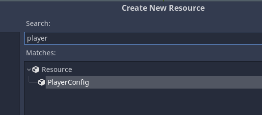

Register custom resources for Godot mono

Settings (Open Project -> ProjectSettings -> General -> CustomResourceRegister:
* ScriptsFolder - Scripts folder. The path to the script is calculated as follows: $"{ScriptsFolder}/{class.Namespace}/{class.Name}.cs"
* ClassPrefix - Prefix the class name to sort in the inspector

Example:

Script res://Example/PlayerConfig.cs
```C#
using Godot;

namespace Example
{
	public class PlayerConfig : Resource
	{
		[Export]
		public int Health;

		[Export]
		public int Speed;
	}
}
```

Context menu "New Resource...":
