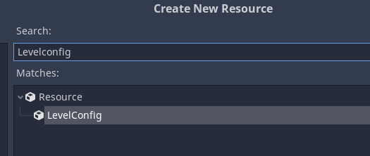
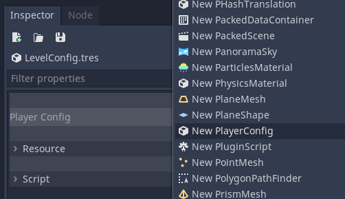
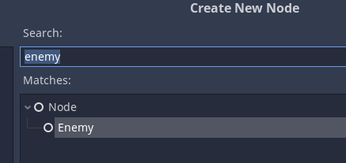
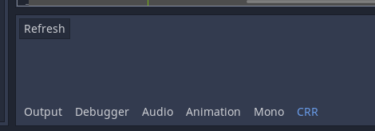

# CustomResourceRegisterPlugin

Register custom resources for Godot mono

## Example
### Custom resource

Script res://Example/LevelConfig.cs
```C#
using Godot;

namespace Example
{
	public class LevelConfig : Resource
	{
		[Export]
		public PlayerConfig PlayerConfig;
	}
}
```

Script res://Example/PlayerConfig.cs
```C#
using Godot;

namespace Example
{
	public class PlayerConfig : Resource
	{
		[Export]
		public int Speed;
	}
}
```

Create LevelConfig.tres int context menu "New Resource...":



Cerate PlayerConfig in LevelConfig.tres (Open LevelConfig.tres and create PlayerConfig):




### Custom node

```C#
using Godot;

namespace Example
{
	public class Enemy : KinematicBody2D
	{

	}
}
```

Add Enemy in scene (context menu "Add Child Node")



## Install

Clone this repository and move folder addons/CustomResourceRegister in {your project}/addons/

## Settings

Project -> ProjectSettings -> General -> CustomResourceRegister:
* ScriptsFolder - Scripts folder. The path to the script is calculated as follows: $"{ScriptsFolder}/{class.Namespace}/{class.Name}.cs"
* ClassPrefix - Prefix the class name to sort in the inspector

To register new created classes press "Refresh" in bottom panel "CRR"

